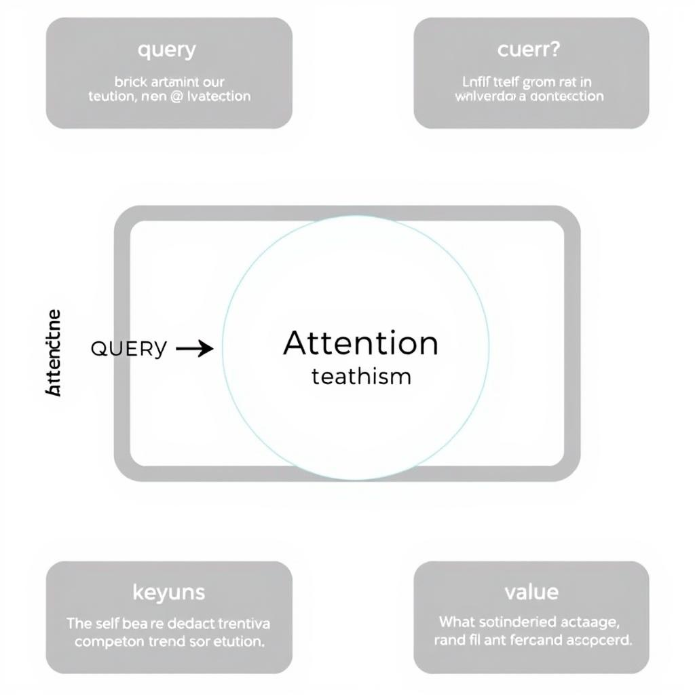
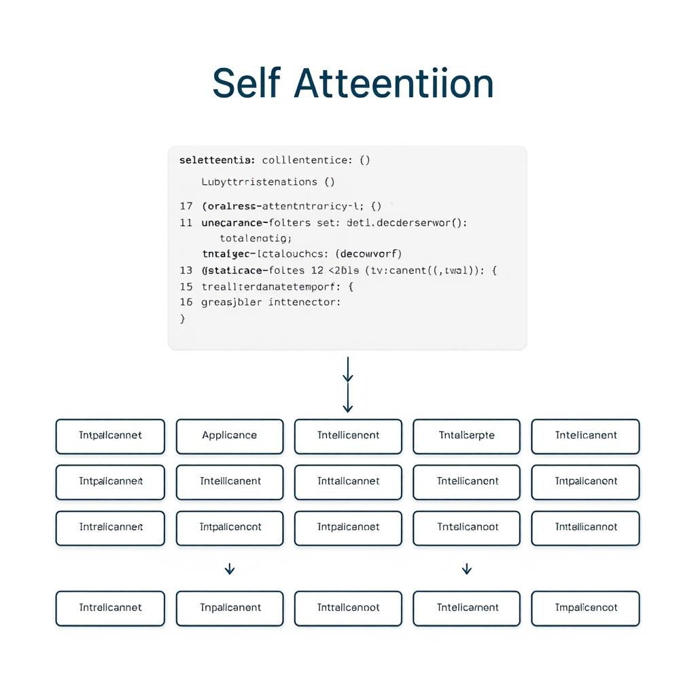
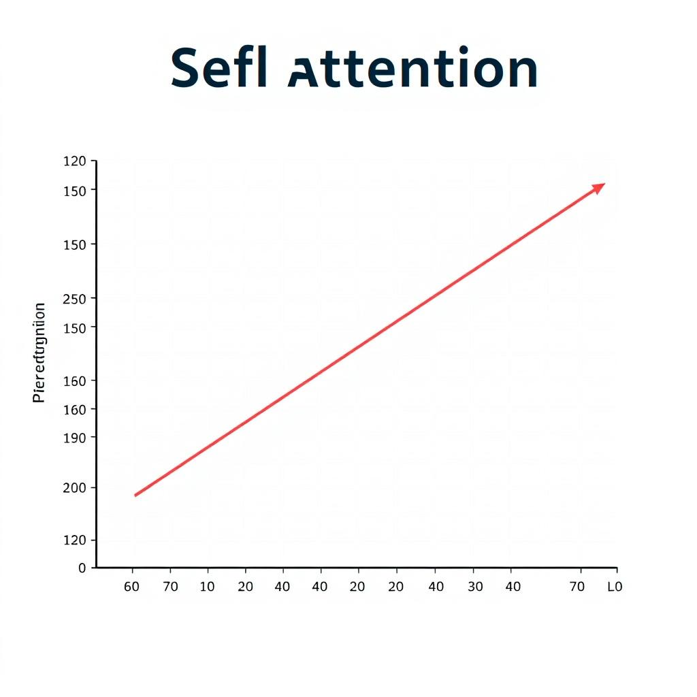

# Understanding Self Attention in Transformer Architecture
## Introduction to Self Attention
Self attention is a key component in transformer architecture, allowing the model to attend to different parts of the input sequence simultaneously and weigh their importance. The purpose of self attention is to enable the model to capture long-range dependencies and contextual relationships within the input sequence, which is essential for sequence-to-sequence models.
* Self attention is defined as a mechanism that computes the representation of a sequence by relating each element of the sequence to every other element, allowing the model to capture complex patterns and relationships.
* In contrast to traditional attention mechanisms, self attention does not rely on recurrent neural networks (RNNs) or convolutional neural networks (CNNs) to process the input sequence. Instead, it uses a set of attention weights to compute the representation of the sequence, making it more parallelizable and efficient.
* The benefits of self attention in sequence-to-sequence models include improved handling of long-range dependencies, better capture of contextual relationships, and increased parallelization, leading to faster training and inference times. Overall, self attention is a crucial component of transformer architecture, enabling the model to effectively process and generate sequences of data.
## Mathematical Formulation of Self Attention
The self attention mechanism is a core component of the Transformer architecture, allowing the model to weigh the importance of different input elements relative to each other. To understand self attention, it's essential to derive the self attention equation step-by-step. The equation is based on the dot-product attention mechanism, which calculates the attention weights by taking the dot product of the query and key vectors.
* The self attention equation is derived as follows:
  * First, we calculate the attention scores by taking the dot product of the query (Q) and key (K) vectors and applying a scaling factor: `Attention Scores = Q * K^T / sqrt(d_k)`, where `d_k` is the dimensionality of the key vector.
  * Next, we apply a softmax function to the attention scores to obtain the attention weights: `Attention Weights = softmax(Attention Scores)`.
  * Finally, we calculate the output of the self attention mechanism by taking the dot product of the attention weights and the value (V) vector: `Output = Attention Weights * V`.

*Self attention mechanism*
The role of query, key, and value vectors in self attention is crucial. The query vector represents the context in which the attention is being applied, the key vector represents the information being attended to, and the value vector represents the information being retrieved. The attention mechanism calculates the importance of each key-value pair relative to the query, allowing the model to selectively focus on certain parts of the input.
## Implementing Self Attention
To implement self attention in a transformer model, you need to understand the key components involved. 
### Code Implementation
A minimal code sketch for self attention implementation can be provided using the following Python code:
```python
import torch
import torch.nn as nn
import torch.nn.functional as F

class SelfAttention(nn.Module):
    def __init__(self, embed_dim, num_heads):
        super(SelfAttention, self).__init__()
        self.embed_dim = embed_dim
        self.num_heads = num_heads
        self.query_linear = nn.Linear(embed_dim, embed_dim)
        self.key_linear = nn.Linear(embed_dim, embed_dim)
        self.value_linear = nn.Linear(embed_dim, embed_dim)
        self.dropout = nn.Dropout(0.1)

    def forward(self, x):
        # Get the query, key, and value vectors
        query = self.query_linear(x)
        key = self.key_linear(x)
        value = self.value_linear(x)

        # Compute the attention scores
        attention_scores = torch.matmul(query, key.transpose(-1, -2)) / math.sqrt(self.embed_dim)

        # Apply masking to prevent attending to future tokens
        attention_mask = torch.triu(torch.ones(attention_scores.size(-1), attention_scores.size(-1)), diagonal=1)
        attention_scores = attention_scores - attention_mask * 1e9

        # Compute the weighted sum of the value vectors
        attention_weights = F.softmax(attention_scores, dim=-1)
        attention_output = torch.matmul(attention_weights, value)

        return attention_output
```

*Self attention implementation*
### Masking and Edge Cases
Masking is crucial in self attention to prevent the model from attending to future tokens, which can lead to information leakage. 
* Masking is applied by subtracting a large value from the attention scores for the tokens that should not be attended to.
* Edge cases and failure modes in self attention implementation include:
  * **NaN values**: can occur due to division by zero or logarithm of zero.
  * **Infinity values**: can occur due to exponential overflow.
  * **Dead neurons**: can occur due to large negative values in the attention scores.
To handle these edge cases, it's essential to add checks and handle exceptions properly. 
Additionally, techniques like gradient clipping and weight normalization can help stabilize the training process.
## Performance and Cost Considerations
The self attention mechanism in transformer models has significant performance and cost implications. 
* The computational complexity of self attention is O(n^2), where n is the sequence length, due to the pairwise interactions between input elements.
* The memory requirements for self attention calculations are also substantial, as they require storing the attention weights and the input sequences, which can be memory-intensive for long sequences.
* In comparison to other attention mechanisms, self attention tends to be more computationally expensive, but it provides more flexible and parallelizable attention patterns, which can lead to better performance in certain tasks, such as machine translation and text generation.

*Self attention performance*
## Conclusion and Future Directions
The self attention mechanism in transformer architecture has been explored, highlighting its ability to handle sequential data. 
Key takeaways include its parallelization capabilities and ability to capture long-range dependencies.
Potential applications include natural language processing and computer vision, but limitations such as computational cost and interpretability exist.
Future research directions may focus on improving efficiency and exploring new architectures that incorporate self attention, such as multimodal transformers.
