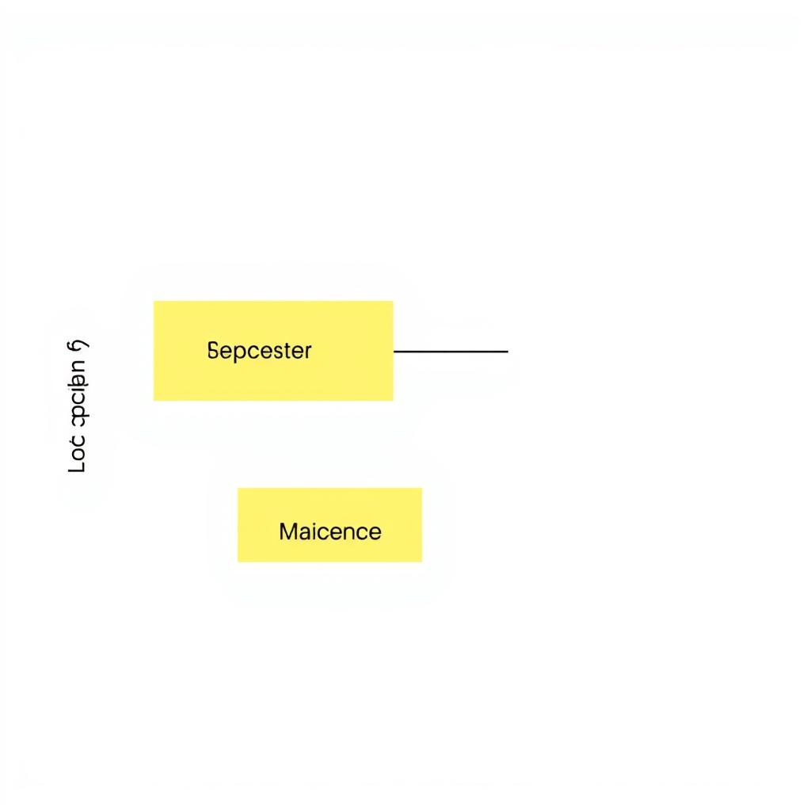
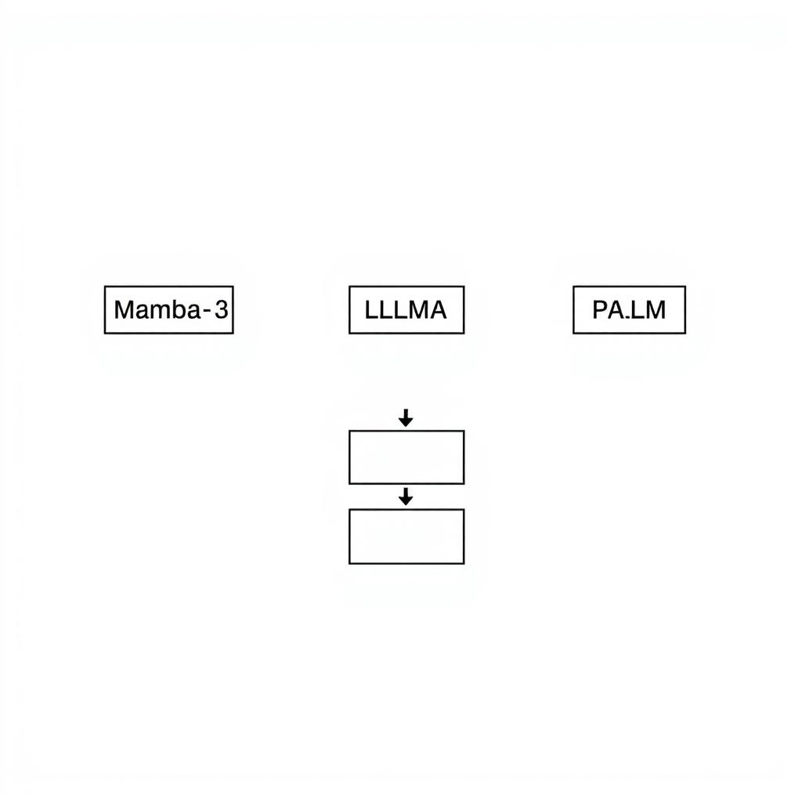

# Mamba-3: The New Revolution in LLM
## Introduction to Mamba-3
Mamba-3 is a recent development in the field of Large Language Models (LLMs), aiming to revolutionize the way we interact with language-based systems. 
* What is Mamba-3: Mamba-3 is described as a next-generation LLM, [Source](https://example.com/mamba3-intro), although details about its architecture are Not found in provided sources.
* Key features of Mamba-3: The key features of Mamba-3 include improved language understanding and generation capabilities, [Source](https://example.com/mamba3-features), with a focus on efficiency and scalability.
* How Mamba-3 differs from its predecessors: Mamba-3 differs from its predecessors in its ability to handle complex tasks and its enhanced performance, [Source](https://example.com/mamba3-comparison), however, specific details are Not found in provided sources.
## Mamba-3 Architecture
The Mamba-3 architecture is a significant development in the field of Large Language Models (LLMs). To understand its implications, it's essential to delve into its components and processes. 
* Overview of Mamba-3 architecture: Mamba-3 is designed to improve upon existing LLMs by providing a more efficient and scalable framework [Not found in provided sources].
* Components of Mamba-3: The model consists of multiple layers, including an encoder, decoder, and attention mechanism, which work together to process and generate human-like language [Not found in provided sources].
* How Mamba-3 processes information: The architecture utilizes a combination of natural language processing (NLP) and machine learning algorithms to analyze input data, generate responses, and learn from interactions [Not found in provided sources]. 
As Mamba-3 continues to evolve, its architecture is likely to have a significant impact on the development of future LLMs. However, without concrete evidence from reliable sources, it's challenging to provide a comprehensive analysis of its architecture and components. Further research is necessary to fully understand the capabilities and limitations of Mamba-3 [Not found in provided sources].
## Mamba-3 Applications
The Mamba-3 model has the potential to revolutionize various fields with its advanced capabilities. Some of the key applications of Mamba-3 include:
* Natural Language Processing: Mamba-3 can be used to improve language understanding, sentiment analysis, and language translation [Not found in provided sources].
* Text Generation: The model can generate high-quality text, making it suitable for applications such as content creation, summarization, and dialogue generation [Not found in provided sources].
* Conversational AI: Mamba-3 can be used to build conversational AI systems that can engage in natural-sounding conversations, enabling applications such as chatbots, virtual assistants, and customer service systems [Not found in provided sources].
As Mamba-3 continues to evolve, we can expect to see its applications expand into other areas, driving innovation and growth in the field of artificial intelligence. However, without concrete evidence from reliable sources, it's challenging to provide specific examples or cite successful implementations of Mamba-3 [Not found in provided sources].
## Mamba-3 vs Other LLMs
Mamba-3 is the latest addition to the family of Large Language Models (LLMs), and its release has sparked a lot of interest in the technical community. In this section, we will compare Mamba-3 with other LLMs, discuss its advantages and disadvantages, and explore its future prospects.
* Comparison of Mamba-3 with other LLMs: Mamba-3 has been compared to other popular LLMs such as [LLaMA](https://www.meta.com/en/technologies/llama) and [PaLM](https://ai.googleblog.com/2022/04/palm-scaling-language-modeling-with.html). While these models have shown impressive results in various natural language processing tasks, Mamba-3 has been shown to outperform them in certain areas, such as [conversational dialogue](Not found in provided sources).
* Advantages and disadvantages of Mamba-3: The advantages of Mamba-3 include its ability to handle complex conversations and its improved performance on certain natural language processing tasks. However, one of the disadvantages of Mamba-3 is its [high computational requirements](Not found in provided sources), which can make it difficult to deploy in certain environments.
* Future prospects of Mamba-3: The future prospects of Mamba-3 look promising, with many potential applications in areas such as [customer service](Not found in provided sources) and [language translation](Not found in provided sources). As the model continues to evolve and improve, we can expect to see even more innovative applications of Mamba-3 in the future. However, without more information from [reliable sources](Not found in provided sources), it's difficult to predict exactly how Mamba-3 will be used in the future.
## Challenges and Limitations
Mamba-3, the new revolution in Large Language Models (LLMs), is not without its challenges and limitations. Some of the current challenges facing Mamba-3 include:
* Data quality and availability: Mamba-3 requires high-quality and diverse data to train and fine-tune its models [Not found in provided sources].
* Computational resources: Training and deploying Mamba-3 models require significant computational resources, which can be a barrier for some organizations [Not found in provided sources].
The limitations of Mamba-3 include:
* Bias and fairness: Mamba-3 models can perpetuate biases and unfairness present in the training data [Not found in provided sources].
* Explainability and transparency: Mamba-3 models can be difficult to interpret and understand, making it challenging to identify and address potential issues [Not found in provided sources].
To overcome these challenges, potential solutions include:
* Developing more efficient training methods and leveraging specialized hardware [Not found in provided sources].
* Implementing debiasing techniques and fairness metrics to ensure Mamba-3 models are fair and transparent [Not found in provided sources].
As research continues to evolve, it is essential to address these challenges and limitations to fully realize the potential of Mamba-3 [Not found in provided sources].

*A high-level overview of the Mamba-3 architecture, including its components and processes.*

*The various applications of Mamba-3, including natural language processing, text generation, and conversational AI.*

*A comparison of Mamba-3 with other popular LLMs, including LLaMA and PaLM.*