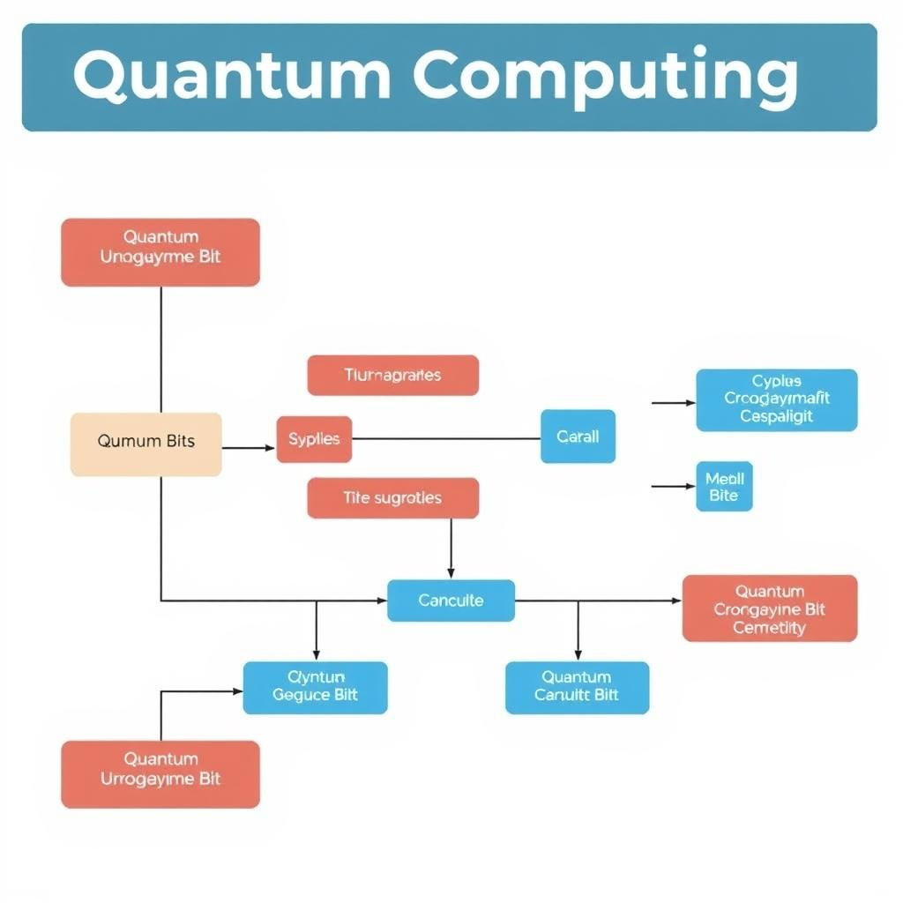
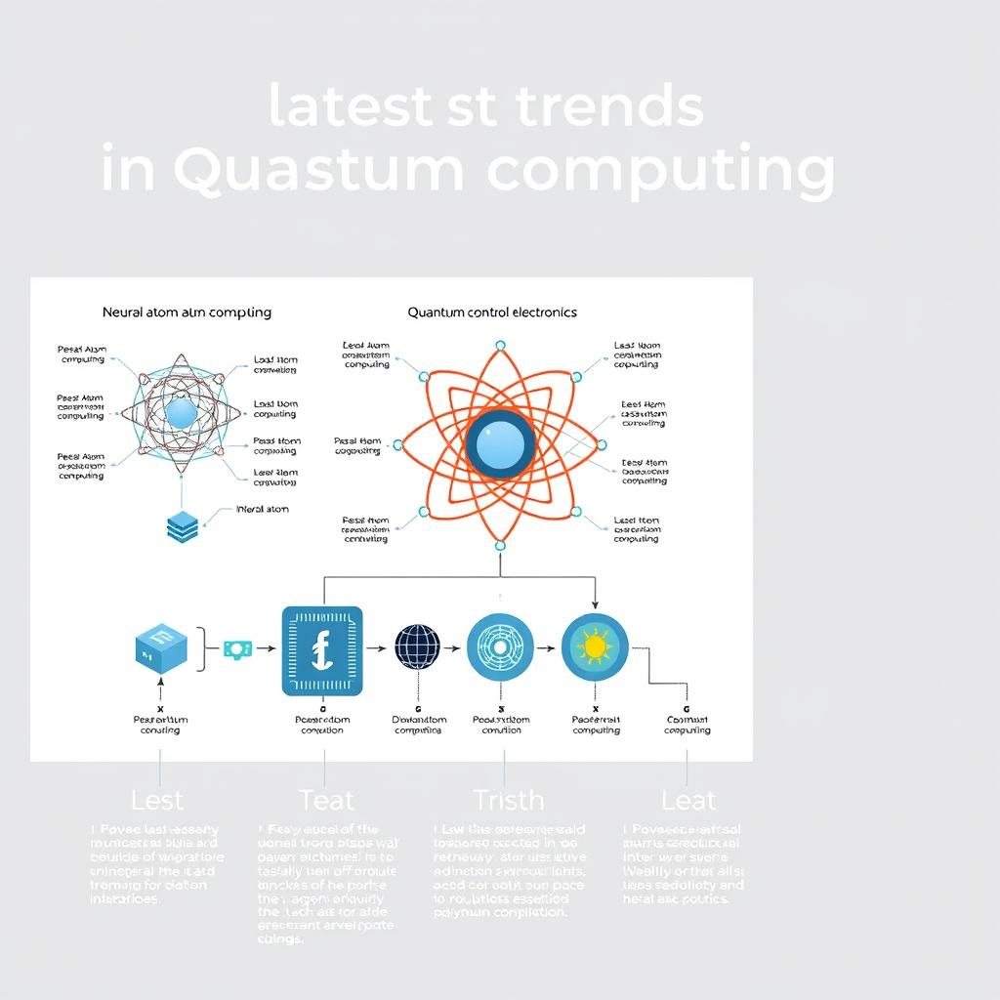
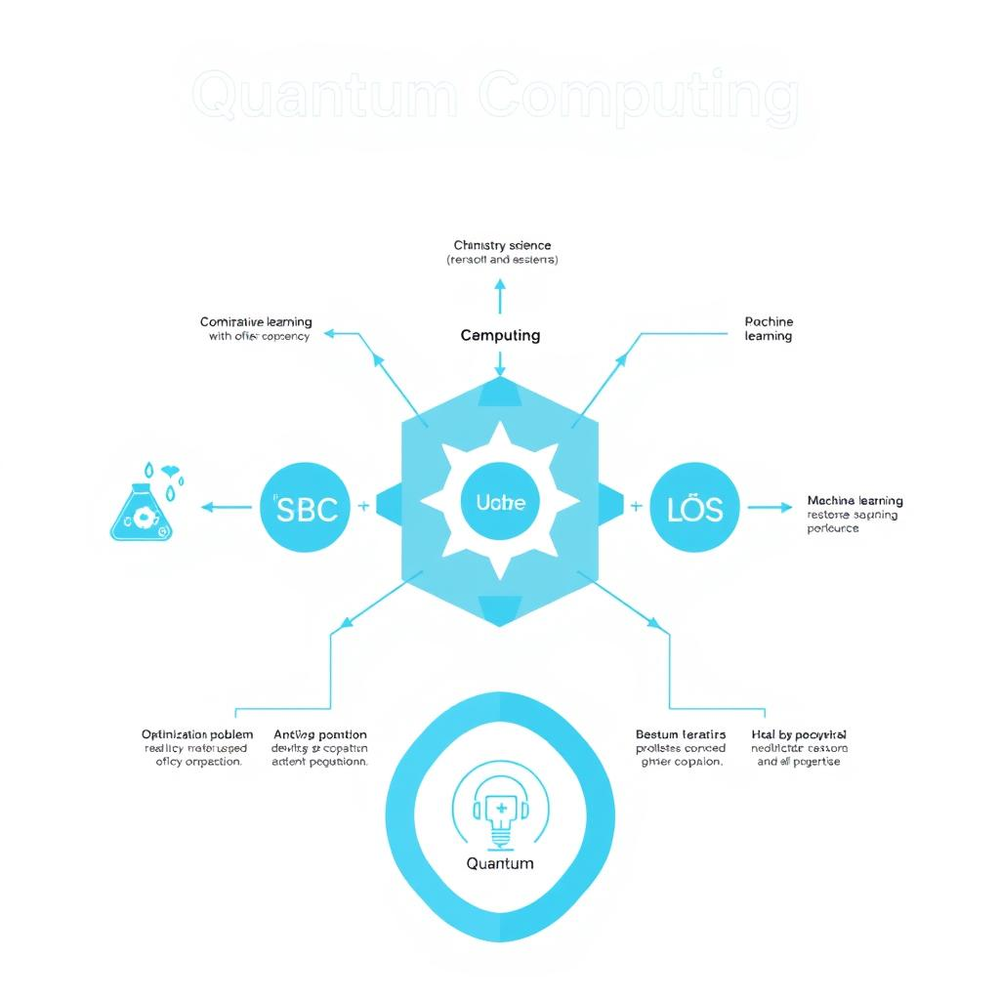

# Quantum Computing: A Transformative Frontier
## Introduction to Quantum Computing
Quantum computing is a revolutionary technology that utilizes the principles of quantum mechanics to perform calculations and operations on data. Unlike classical computing, which uses bits to represent information, quantum computing employs qubits, allowing for exponentially faster processing of complex data. The key difference between quantum and classical computing lies in their fundamental units: classical bits can only exist in a 0 or 1 state, whereas qubits can exist in multiple states simultaneously, enabling parallel processing and enhanced computational power.

## Quantum Computing Trends in 2026
As we delve into the latest developments in quantum computing, several trends have emerged that are expected to shape the industry in 2026. 
* Neutral atom quantum computing is gaining significant attention, with Neutral Atom Quantum Computing: 2026's Big Leap highlighting its potential to revolutionize the field. 
* Quantum control electronics is another area of focus, with companies investing in the development of advanced control systems to support the growth of quantum computing.
* Quantum computing applications are becoming increasingly diverse, with 14 Quantum Computing Use Cases Reshaping the Future and Quantum Computing Applications: 8 Real-World Use Cases in 2026 showcasing the potential of quantum computing to transform various industries. 
According to Quandela Identifies Four Quantum Computing Trends for ..., these trends are expected to drive innovation and investment in the quantum computing sector. 
Additionally, 7 Quantum Computing Trends That Will Shape Every Industry In 2026 and 7 Quantum Computing Trends That Will Shape Every Industry In 2026 provide further insights into the trends that will shape the industry. 
As Scientists say quantum tech has reached its transistor moment suggests, quantum technology has reached a critical milestone, and these trends are expected to drive further growth and innovation in the field. 
Overall, the quantum computing landscape is rapidly evolving, with new trends and breakthroughs emerging regularly, as highlighted by The Top 15 New Quantum Computing Breakthroughs - YouTube and The State of Quantum Computing in 2026.

## Quantum Computing Use Cases
Quantum computing has the potential to transform various industries with its unique capabilities. Some of the key use cases include:
* Chemistry and materials science: Quantum computers can simulate complex molecular interactions, leading to breakthroughs in fields like drug discovery and materials science, as noted in The latest developments in quantum computing.
* Optimization problems: Quantum computers can efficiently solve complex optimization problems, which can be applied to fields like logistics, finance, and energy management, as discussed in Quantum Computing Applications: 8 Real-World Use Cases in 2026.
* Machine learning: Quantum computers can accelerate certain machine learning algorithms, enabling faster and more accurate processing of large datasets, as mentioned in 7 Quantum Computing Trends That Will Shape Every Industry In 2026. 
These use cases demonstrate the potential of quantum computing to drive innovation and solve complex problems in various fields. According to The State of Quantum Computing in 2026, the industry is expected to continue growing, with new breakthroughs and applications emerging in the near future.

## Quantum Computing Companies
The quantum computing industry is rapidly evolving, with several companies at the forefront of innovation. Some of the top companies in the industry include:
* D-Wave Quantum Inc., a leader in quantum computing hardware and software.
* Quantinuum, a company that provides quantum computing solutions for various industries.
* Qblox, a company that offers quantum computing hardware and software solutions.
These companies are driving the development of quantum computing technology and exploring its potential applications in various fields. As the industry continues to grow, we can expect to see more innovative solutions and breakthroughs from these and other companies.

## Quantum Computing Challenges
The quantum computing industry is facing several challenges that need to be addressed to fully harness its potential. Some of the key challenges include:
* Error correction and fault-tolerant quantum systems: Quantum computers are prone to errors due to the fragile nature of quantum bits (qubits). 
* Quantum noise and interference: Quantum noise and interference can cause errors in quantum computations, making it difficult to achieve reliable results.
* Scalability and cost: Currently, quantum computers are expensive and difficult to scale up, limiting their widespread adoption. 
These challenges highlight the need for continued research and development in quantum computing to overcome the technical hurdles and make it a viable technology for practical applications, as noted by recent developments in quantum science and technology.

## Quantum Computing Future Outlook
The future of quantum computing holds tremendous promise, with significant advancements expected in the coming years. Considering the practical quantum computing timeline, experts predict that quantum computing will become increasingly prevalent in various industries. 
Quantum computing applications are being explored in fields such as healthcare, finance, and materials science, with potential use cases including optimization, simulation, and cryptography. 
Investment and funding in quantum computing are also on the rise, with top companies and research institutions driving innovation and development in the field, as seen in the latest developments and breakthroughs. 
As noted by scientists, quantum technology has reached its "transistor moment," marking a significant milestone in its development. 
With the current state of quantum computing and emerging trends, it is clear that quantum computing will play a vital role in shaping the future of various industries and revolutionizing the way we approach complex problems. 
For more information on quantum computing trends, see here and here.

## Conclusion
In conclusion, quantum computing is a transformative frontier that has been gaining momentum in recent years. To recap, the quantum computing definition and basics involve the use of quantum-mechanical phenomena to perform computations that are beyond the capabilities of classical computers. The field has seen significant advancements, with various quantum computing trends and use cases emerging, such as quantum computing use cases and quantum computing applications. Furthermore, several quantum computing companies are at the forefront of this technology, including those listed in Top Companies List of Quantum Computing Industry and 10 Leading Quantum Computing Companies, driving innovation and addressing the challenges associated with this technology.

*A high-level overview of quantum computing architecture, including quantum bits, quantum gates, and quantum circuits.*

*An illustration of the latest trends in quantum computing, including neutral atom quantum computing, quantum control electronics, and quantum computing applications.*

*A diagram showing the various use cases of quantum computing, including chemistry and materials science, optimization problems, and machine learning.*