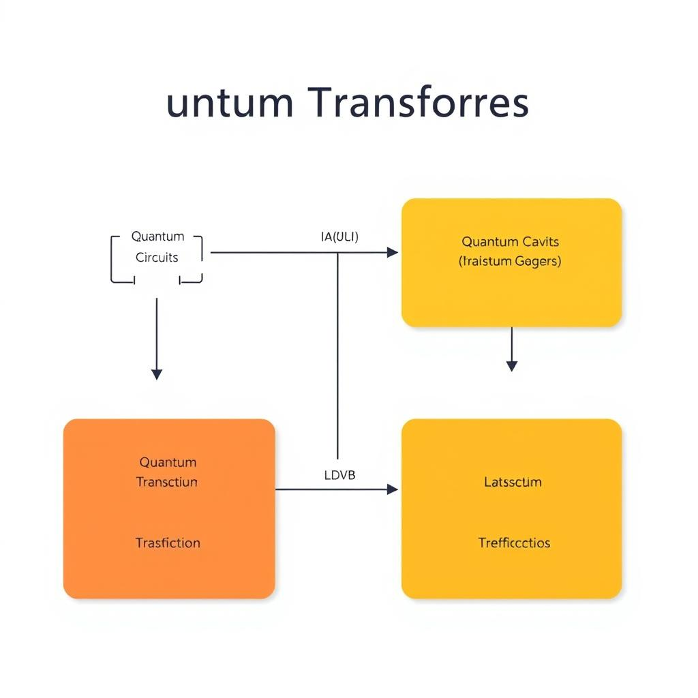
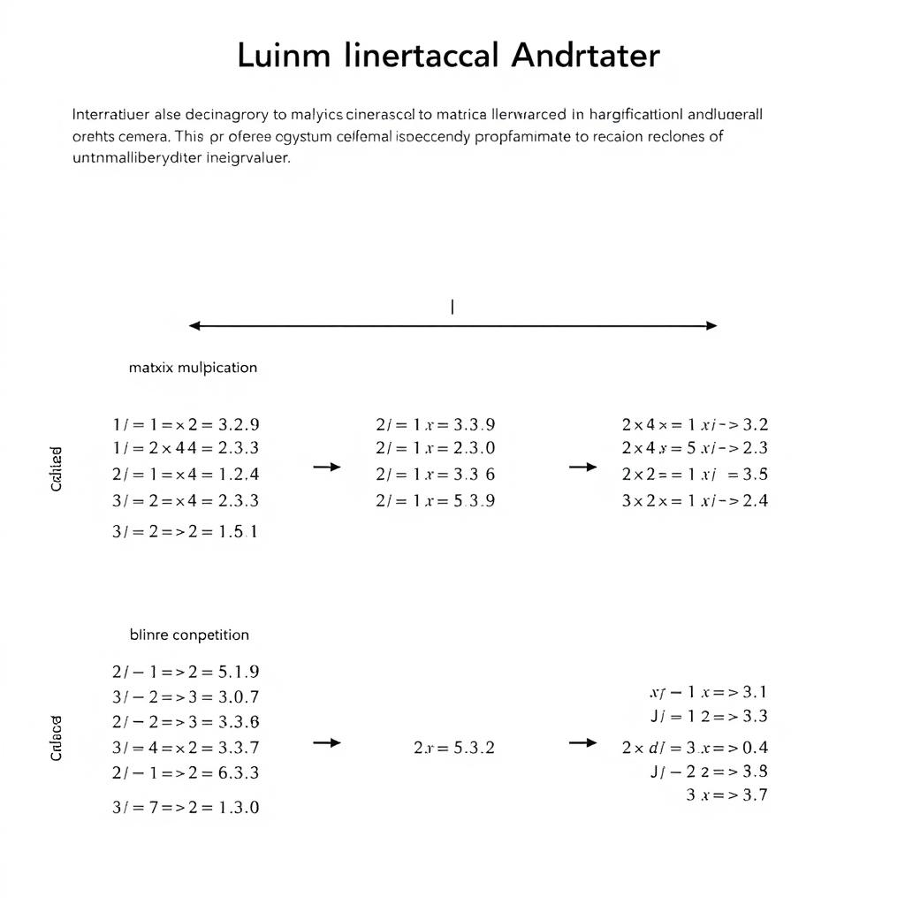
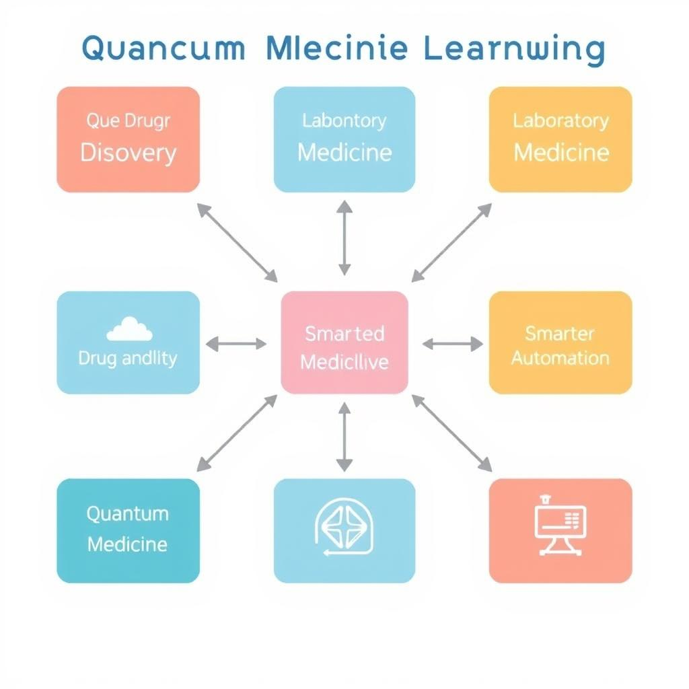

# Quantum Machine Learning Transformer: A Comprehensive Guide
## Introduction to Quantum Machine Learning
Quantum Machine Learning (QML) is a subfield of machine learning that leverages the principles of quantum mechanics to improve the performance and efficiency of machine learning models.
## Quantum Transformers: Architecture and Challenges
The concept of Quantum Transformers is an emerging area of research that combines the principles of quantum computing and machine learning to develop more efficient and powerful models.

*Quantum Transformer Architecture*
## Quantum Linear Algebra for Transformer Architectures
Quantum Linear Algebra (QLA) is a fundamental concept in Quantum Machine Learning (QML) that has gained significant attention in recent years.

*Quantum Linear Algebra for Transformer*
## Future Directions and Applications of Quantum Machine Learning
The potential applications of Quantum Machine Learning are vast and varied, with possibilities in fields such as drug discovery and laboratory medicine.

*Quantum Machine Learning Applications*
