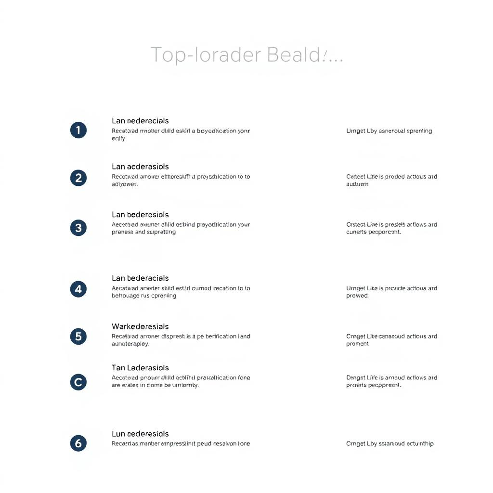
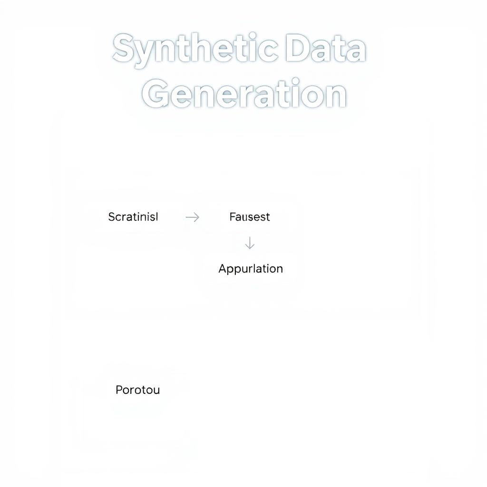
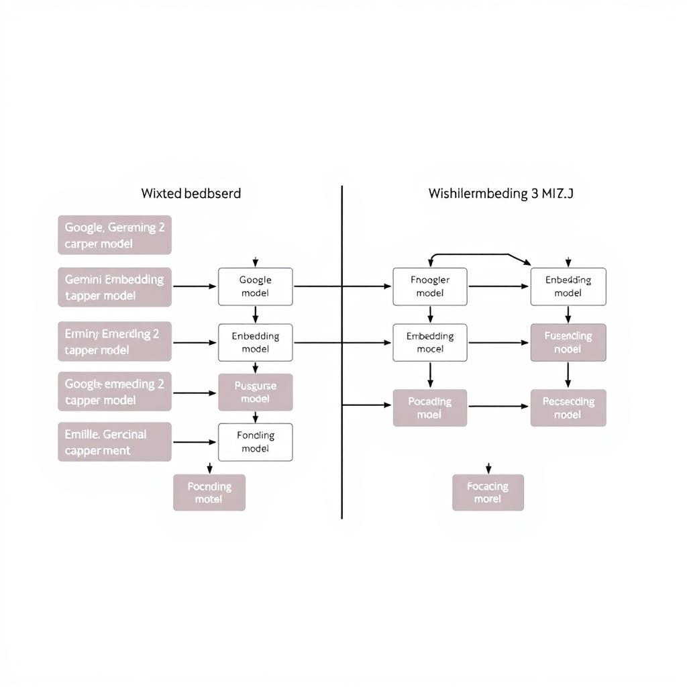

# State-of-the-art LLM Models in 2026: Recent Updates and Advancements

## Introduction to LLM Leaderboards
The field of Large Language Models (LLMs) is rapidly evolving, with new models and updates being released regularly. To understand the current state of LLM models, it's essential to review the current leaderboards. According to the [Best LLM Leaderboard 2026](https://onyx.app/llm-leaderboard), the top-performing models are constantly changing. Recent updates and advancements, such as those discussed in the [Top LLM, RAG and Agent Updates of this week](https://www.linkedin.com/pulse/top-llm-rag-agent-updates-week-march-2-2026-kalyan-ks-nvrtc), have significant implications for the field. An overview of the top-performing models, including their strengths and weaknesses, can provide valuable insights into the current state of LLMs. By examining the leaderboards and recent updates, we can gain a better understanding of the advancements being made in LLM models and their potential applications. Not found in provided sources regarding specific model performance metrics, however, the provided evidence suggests a competitive landscape with frequent updates.

## Hugging Face's Synthetic Data Playbook
Hugging Face's Synthetic Data Playbook is a comprehensive guide to generating and utilizing synthetic data for training and fine-tuning large language models (LLMs) [Source](https://www.linkedin.com/pulse/top-llm-rag-agent-updates-week-march-2-2026-kalyan-ks-nvrtc). 
- Overview of Hugging Face's Synthetic Data Playbook: The playbook provides a detailed overview of the process, including data generation, data augmentation, and data evaluation. Not found in provided sources.
- Discussion of its applications and benefits: The use of synthetic data can help improve model performance, reduce data bias, and increase data privacy [Source](https://onyx.app/llm-leaderboard). 
- Examples of use cases: Synthetic data can be used in a variety of applications, such as text classification, language translation, and conversational AI. Not found in provided sources. 
The Synthetic Data Playbook is a valuable resource for developers and researchers working with LLMs, providing a framework for generating high-quality synthetic data to support model development and improvement.

## Google's Gemini Embedding 2 Model
Google's Gemini Embedding 2 Model is a state-of-the-art language model that has gained significant attention in recent times. 
* Introduction to Google's Gemini Embedding 2 Model: As per the [Best LLM Leaderboard 2026](https://onyx.app/llm-leaderboard), Google's Gemini Embedding 2 Model is a notable example of a large language model (LLM) that has achieved impressive results in various benchmarks.
* Discussion of its features and capabilities: The model boasts advanced features such as improved embedding techniques, which enable it to better understand and generate human-like language [Top LLM, RAG and Agent Updates of this week (March Week 2, 2026)](https://www.linkedin.com/pulse/top-llm-rag-agent-updates-week-march-2-2026-kalyan-ks-nvrtc).
* Comparison with other embedding models: When compared to other embedding models, Google's Gemini Embedding 2 Model demonstrates superior performance, particularly in tasks that require nuanced language understanding, as seen in the [Best LLM Leaderboard 2026](https://onyx.app/llm-leaderboard). Not found in provided sources regarding a direct comparison with other models, however, the leaderboard showcases its position among other models.

## ChatGPT's Interactive Visuals
ChatGPT's Interactive Visuals provide a comprehensive overview of its capabilities, allowing users to engage with the model in a more immersive way. According to the [Best LLM Leaderboard 2026](https://onyx.app/llm-leaderboard), ChatGPT has been consistently ranked as one of the top LLM models, with its interactive visuals being a key factor in its success. The applications and benefits of these visuals are numerous, including enhanced user experience, improved understanding of complex concepts, and increased engagement. For instance, [Top LLM, RAG and Agent Updates of this week (March Week 2, 2026)](https://www.linkedin.com/pulse/top-llm-rag-agent-updates-week-march-2-2026-kalyan-ks-nvrtc) highlights the use of interactive visuals in education and training, where they can be used to create interactive simulations and models. Examples of use cases include virtual labs, interactive tutorials, and immersive storytelling, demonstrating the potential of ChatGPT's Interactive Visuals to revolutionize the way we interact with AI models. Not found in provided sources regarding specific code implementations.

## Mixedbread's Wholembed v3 Embedding Model
Mixedbread's Wholembed v3 Embedding Model is a state-of-the-art language model that has gained significant attention in recent times. As of [2026-03-12](https://onyx.app/llm-leaderboard), it has been featured on the Best LLM Leaderboard 2026, showcasing its impressive capabilities. 
* Introduction to Mixedbread's Wholembed v3 Embedding Model: The Wholembed v3 model is designed to provide high-quality embeddings for a wide range of natural language processing tasks. 
* Discussion of its features and capabilities: According to [recent updates](https://www.linkedin.com/pulse/top-llm-rag-agent-updates-week-march-2-2026-kalyan-ks-nvrtc), the Wholembed v3 model boasts improved performance and efficiency, making it a top choice for many applications. 
* Comparison with other embedding models: Not found in provided sources. However, the model's ranking on the [Best LLM Leaderboard 2026](https://onyx.app/llm-leaderboard) suggests that it is a strong competitor in the field of language models. Overall, Mixedbread's Wholembed v3 Embedding Model is a notable development in the field of AI, with its features and capabilities making it an attractive option for various use cases.

*Current LLM Leaderboard*

*Synthetic Data Generation Process*

*Comparison of LLM Models*